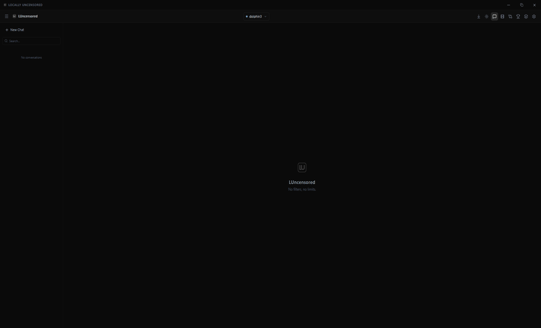

<div align="center">

# 🔓 Locally Uncensored

**The only local AI app that does Chat + Images + Video — all in one beautiful UI.**

No cloud. No censorship. No data collection. Just you and your AI.

[](https://opensource.org/licenses/MIT)
[](https://github.com/PurpleDoubleD/locally-uncensored/stargazers)
[](https://github.com/PurpleDoubleD/locally-uncensored/commits)
[](https://github.com/PurpleDoubleD/locally-uncensored/discussions)



*Chat with AI personas, generate images, create videos — all running locally on your machine.*

[Getting Started](#-quick-start) · [Features](#-features) · [Why This App?](#-why-locally-uncensored) · [Roadmap](#-roadmap) · [Contributing](CONTRIBUTING.md)

</div>

---

### 📸 Screenshots

| Chat with Personas | Image & Video Creation | Model Manager |
|:---:|:---:|:---:|
|  |  |  |
| **Light Mode** | **Settings** | **Landing** |
|  |  |  |

---

## ❓ Why Locally Uncensored?

Tired of switching between Ollama for chat, ComfyUI for images, and another tool for video? Frustrated with bloated UIs that need Docker and a PhD to set up?

**Locally Uncensored** is the all-in-one solution. One app. One setup. Everything local.

### How it compares

| Feature | Locally Uncensored | Open WebUI | LM Studio | SillyTavern |
|---------|:-:|:-:|:-:|:-:|
| AI Chat | ✅ | ✅ | ✅ | ✅ |
| Image Generation | ✅ | ❌ | ❌ | ❌ |
| Video Generation | ✅ | ❌ | ❌ | ❌ |
| Uncensored by Default | ✅ | ❌ | ❌ | ⚠️ |
| One-Click Setup | ✅ | ❌ (Docker) | ✅ | ❌ (Node.js) |
| 25+ Built-in Personas | ✅ | ❌ | ❌ | ⚠️ (manual) |
| Modern UI | ✅ | ✅ | ✅ | ❌ |
| Open Source | ✅ | ✅ | ❌ | ✅ |
| No Docker Required | ✅ | ❌ | ✅ | ✅ |
| 100% Offline | ✅ | ✅ | ✅ | ✅ |

---

## ✨ Features

- **Uncensored AI Chat** — Run abliterated models locally with zero restrictions
- **Image Generation** — Text-to-image via ComfyUI with full parameter control
- **Video Generation** — Text-to-video with Wan 2.1/2.2 and AnimateDiff support
- **25+ Personas** — From Helpful Assistant to Roast Master, ready out of the box
- **Model Manager** — Browse, install, and switch models with one click
- **Discover & Install Models** — Browse and one-click install text, image, and video models directly in the app
- **Thinking Display** — See the AI's reasoning in collapsible blocks
- **Dark/Light Mode** — Beautiful glassmorphism UI that actually looks good
- **100% Local** — Everything runs on your machine, nothing touches the internet
- **Conversation History** — All chats saved locally in your browser

## Tech Stack

- **Frontend**: React 19, TypeScript, Tailwind CSS 4, Framer Motion
- **State**: Zustand with localStorage persistence
- **AI Backend**: Ollama (text), ComfyUI (images/video)
- **Build**: Vite 8

---

## 🚀 Quick Start

### Windows

```bash
git clone https://github.com/PurpleDoubleD/locally-uncensored.git
cd locally-uncensored
setup.bat
```

### Linux / macOS

```bash
git clone https://github.com/PurpleDoubleD/locally-uncensored.git
cd locally-uncensored
chmod +x setup.sh
./setup.sh
```

The setup script automatically:
1. Checks for Node.js 18+, Git, and Ollama
2. Installs missing dependencies
3. Downloads a recommended uncensored AI model (~5.7 GB)
4. Starts the app in your browser

### Manual Installation

**Prerequisites:** [Node.js](https://nodejs.org/) 18+, [Ollama](https://ollama.com/)

```bash
git clone https://github.com/PurpleDoubleD/locally-uncensored.git
cd locally-uncensored
npm install
npm run dev
```

Open **http://localhost:5173** — the app recommends models on first launch.

### Image & Video Generation

No separate installation needed! When you open the **Create** tab:

1. The app checks for ComfyUI automatically
2. If not found, click **"Install ComfyUI Automatically"** — it clones, installs dependencies, and sets up CUDA in one click
3. Go to **Model Manager → Discover → Image/Video** and click **Install All** on any model bundle
4. Generate images and videos — everything is ready

The entire setup happens inside the app. No terminal commands, no manual config files.

### One-Click Start (Windows)

```batch
start.bat
```

Launches Ollama + ComfyUI + the app in one go.

---

## 🧠 Model Auto-Detection

The app automatically detects all installed models across all backends — no manual configuration needed:

- **Text models** — Auto-detected from Ollama. On first launch, the app scans your hardware and recommends the best uncensored models for your system.
- **Image models** — Auto-detected from ComfyUI's `models/checkpoints` folder. Drop any checkpoint in there and it shows up instantly.
- **Video models** — Auto-detected from ComfyUI. The app identifies your video backend (Wan 2.1/2.2 or AnimateDiff) and lists available models automatically.

Just install models in the standard locations and the app picks them up.

## 🎭 Recommended Models

### Text (Ollama)

| Model | Size | VRAM | Best For |
|-------|------|------|----------|
| Llama 3.1 8B Abliterated | 5.7 GB | 6 GB | Fast all-rounder |
| Qwen3 8B Abliterated | 5.2 GB | 6 GB | Coding |
| Mistral Nemo 12B Abliterated | 6.8 GB | 8 GB | Multilingual |
| DeepSeek R1 8B Abliterated | 5 GB | 6 GB | Reasoning |
| Qwen3 14B Abliterated | 9 GB | 12 GB | High intelligence |

### Image (ComfyUI)

| Model | VRAM | Notes |
|-------|------|-------|
| Juggernaut XL V9 | 8 GB | Best photorealistic |
| FLUX.1 Schnell | 10-12 GB | State-of-the-art |
| Pony Diffusion V6 XL | 8 GB | Anime/stylized |

### Video (ComfyUI)

| Model | VRAM | Output | Notes |
|-------|------|--------|-------|
| Wan 2.1 T2V 1.3B | 8-10 GB | 480p WEBP | Built-in nodes, no extras needed |
| Wan 2.2 T2V 14B (FP8) | 10-12 GB | 480-720p | Higher quality, quantized |
| AnimateDiff v3 + SD1.5 | 6-8 GB | MP4 | Requires AnimateDiff custom nodes |

---

## ⚙️ Configuration

### Environment Variables

Create a `.env` file (see `.env.example`):

```env
# Path to your ComfyUI installation (optional)
COMFYUI_PATH=/path/to/your/ComfyUI
```

### In-App Settings

- **Temperature** — Controls randomness (0 = deterministic, 1 = creative)
- **Top P / Top K** — Fine-tune token sampling
- **Max Tokens** — Limit response length (0 = unlimited)
- **Theme** — Dark or Light mode

---

## 🗺️ Roadmap

- [ ] **RAG / Document Chat** — Upload PDFs and chat with your documents
- [ ] **Audio Generation** — Text-to-speech and music generation
- [ ] **Plugin System** — Extend the app with community plugins
- [ ] **Multi-User Mode** — Share your local AI server with your household
- [ ] **Mobile UI** — Responsive layout for phone/tablet access
- [ ] **Docker Support** — For those who prefer containerized deployments
- [ ] **Custom Persona Creator** — Build and share your own personas
- [ ] **Export/Import** — Backup and restore your chats and settings

Have an idea? [Open a discussion](https://github.com/PurpleDoubleD/locally-uncensored/discussions)!

---

## 📁 Project Structure

```
src/
  api/          # Ollama & ComfyUI API clients
  components/   # React components
    chat/       # Chat UI (messages, input, markdown)
    create/     # Image/Video generation UI
    models/     # Model management
    personas/   # Persona selection
    settings/   # App settings
    ui/         # Reusable UI components
  hooks/        # Custom React hooks
  stores/       # Zustand state management
  types/        # TypeScript definitions
  lib/          # Constants & utilities
```

---

## Contributing

We welcome contributions! Check out the [Contributing Guide](CONTRIBUTING.md) for details on how to get started.

See our [open issues](https://github.com/PurpleDoubleD/locally-uncensored/issues) or the [Roadmap](#-roadmap) for areas where help is needed.

## License

This project is licensed under the MIT License - see the [LICENSE](LICENSE) file for details.

---

<div align="center">

**Built with privacy in mind. Your data stays on your machine.** 🔒

If you find this useful, consider giving it a ⭐

[Report Bug](https://github.com/PurpleDoubleD/locally-uncensored/issues/new?template=bug_report.yml) · [Request Feature](https://github.com/PurpleDoubleD/locally-uncensored/issues/new?template=feature_request.yml) · [Join Discussion](https://github.com/PurpleDoubleD/locally-uncensored/discussions)

</div>
